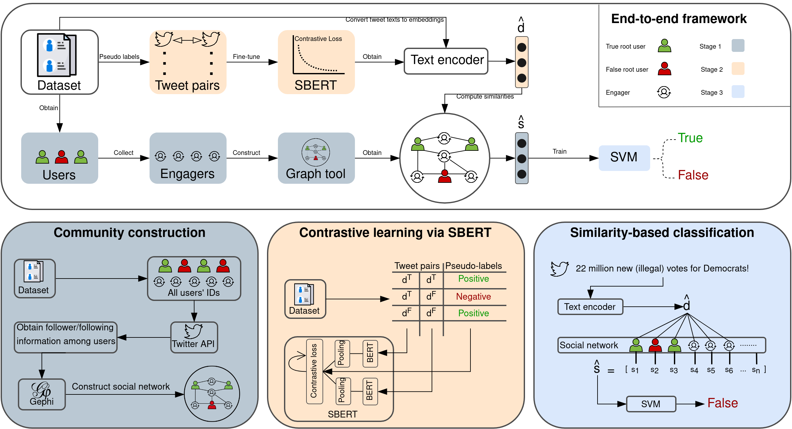

# SiMiD - Similarity-based Misinformation Detection

This repository contains the official implementation of the SiMiD model presented in "Misinformation detection by leveraging user communities: A similarity-based approach on social media posts" paper.

## Datasets

The study uses publicly available [`Twitter15`](https://www.dropbox.com/s/7ewzdrbelpmrnxu/rumdetect2017.zip?dl=0), [`Twitter16`](https://www.dropbox.com/s/7ewzdrbelpmrnxu/rumdetect2017.zip?dl=0), and [`MiDe22`](https://github.com/avaapm/mide22) datasets. We just provide the expected formats of the datasets to run SiMiD model in `dataset` folder. Only `true` and `false` claim labels are employed as the ground truth. Since the original datasets do not contain user profiles and user follower/following information, given user IDs are used to obtain user data via Twitter API. Due to the privacy, we can not provide the data we crawled from the API. However, you may crawl the necessary information via Twitter API and preprocess the data as in the expected formats provided in `dataset` folder.

## Baseline Implementation Details

Many of the models include published code along with well-documented procedures, SAFE and MetaAdapt, facilitating straightforward reimplementation. However, certain models, such as GCAN and TDSL, while having published code, lack comprehensive support for reimplementation by other researchers. For instance, the GCAN model has [source code](https://github.com/l852888/GCAN); however, it lacks essential information on execution and data structure, [hindering reimplementation](https://github.com/l852888/GCAN/issues). Similarly, TDSL poses challenges due to insufficient documentation about execution of the [source code](https://github.com/uvictor-git/fake\_news\_detection). In light of these challenges, we provide each reimplementation process.

DTC model has no original code shared by authors or the research community utilizing the model. Nevertheless, the model is simple to reimplement since it requires a random forest model and various feature types obtained from the textual, user, or diffusion-based data. We use scikit-learn library to implement DTC. The features fed to the model are obtained from the original paper, but we could not use all features due to the unavailability of attributes for each dataset (e.g., depth, size, and node numbers of sub-trees of propagation trees). The SVM-RBF model, also lacking published code, can be reimplemented using the scikit-learn library. The challenging part is to provide event locations of the tweets. Since we do not have this information, we detect locations in tweet texts using the [named entity recognition (NER) function of spaCy library](https://spacy.io/models/en\#en\_core\_web\_sm). After detecting locations in texts, we use them as categorical features to the SVM-RBF model. The CRNN and BERT-BiGRU models are reimplemented, as the original codes for them are unavailable. 

Utilizing CNN and GRU networks, we transform variable-length time series into fixed-length sequences using the algorithm provided by the authors for CRNN. For the BERT-BiGRU model, we first fine-tune the BERT model and obtain token embeddings to train the BiGRU model. Implementation is done using TensorFlow and Hugging Face with the provided hyper-parameters by the authors. Models such as SAFE and MetaAdapt have publicly available source code. We utilize these codes with slight modifications to incorporate our datasets.

## Pseudo-code

<p align="center">
  
</p>

## Environment
- Python 3.8.10
- sentence-transformers 2.2.2
- transformers 4.36.2
- torch 1.13.1

To set up the environment using [`virtual environment`](https://pypi.org/project/virtualenv/) library (venv):

```bash
$ pip install virtualenv
$ virtualenv simid_env
$ source simid_env/bin/activate
$ pip install -r requirements.txt
```

These commands create a virtual environment named `simid_env`. The environment includes all necessary packages to run SiMiD model.

## Stages

### Community Construction

To construct social networks and detect communities, we need to obtain engagers. Engagers are the users who retweet or repost other users' tweets (refer to paper for more detail of the definitions). We collect followers of each user in the datasets using [Twitter API](https://developer.twitter.com/en/products/twitter-api). After obtaining the followers, we only keep the users who have retweeted any of the user from the datasets. Thus, we end up with the engagers who follow other users and retweet the tweets from the datasets. Next, we randomly choose 20% of root users in the datasets to construct social network (here root users are the users who post tweets). Please note that you need to create `train.csv`, `val.csv`, and `test.csv` after this random selection process using the remaining part of the dataset. For a fair train and evaluation we need to keep apart these splits (i.e., social network and train val test files). After that, we use [Gephi](https://gephi.org/) to create social network. The edges are undirected, and nodes are users who follows each other. Using Gephi, we detect communities with Louvain clustering algorithm and obtain `engagers.csv` and `id2tweet.csv` files. In `engagers.csv`, there is a column named `related_tweets`, which is for each node in the social network. It corresponds to tweets IDs of a users' connections. For instance, let an engager node "A" (i.e., a user) is connected to another node "B". If node "B" has published three tweets, then `related_tweets` of node "B" is tweet IDs of that three tweets separated with "%", e.g., 123456%45644554%778464897.

After obtaining aforementioned data, you should obtain `engagers.csv` file. The expected structure of this file can be seen from the folder `dataset` --> `twitter15` --> `engagers.csv`. If you are not able to collect these information, you can still run model without the community information (only using textual data), please see the last stage.

### Fine-tuning of SBERT model

Example commands for fine-tuning [SBERT](https://www.sbert.net/) model with pseudo-labelled pairs constructred from `twitter15` dataset is below:

```bash
$ python3 'src/sbert_trainer.py' twitter15 'dataset/twitter15/' 'src/contrastive_sbert/' 5
```

The command above runs `sbert_trainer.py` file in `src` folder. First provide the dataset name, e.g., `twitter15`. Next, provide the datased folder containing `train.csv` and `val.csv` files. Then, give a path to save fine-tuned SBERT model. Here, the model will be saved in `contrastive_sbert` folder under `src` folder. Finally, provide the pseudo-label pair number, default is 5. Refer to the paper for more details about pair numbers. After obtaining aforementioned information, you should obtain fine-tuned SBERT model under `src/contrastive_sbert/`. Please use this path as `sbert_path` argument to run.py.

### Similarity-based Classification

After obtaining engagers.csv and fine-tuned SBERT model, train and evaluate SiMiD model. Example command for `twitter15` dataset is below to train and test SiMiD model:

```bash
$ python3 'run.py' use-community 'dataset/twitter15/' 'src/contrastive_sbert/' 'src/simid_model/'
```

If you could not collect user information and could not construct social network, you can still use the model without community information and similarity-based classification. In this version of SiMiD, the tweet embeddings obtained from SBERT model is directly fed to SVM model for binary classification. Use commands below:

```bash
$ python3 'run.py' no-community 'dataset/twitter15/' 'src/contrastive_sbert/' 'src/simid_model/'
```

For more details of each version, please refer to the ablation study of the original paper.

## Citation
If you make use of this study, please cite the following paper:
```bibtex
@inproceedings{10375480,
author={Ozcelik, Oguzhan and Toraman, Cagri and Can, Fazli},
booktitle={2023 Tenth International Conference on Social Networks Analysis, Management and Security (SNAMS)}, 
title={SiMiD: Similarity-based Misinformation Detection via Communities on Social Media Posts}, 
year={2023},
volume={},
number={},
pages={1-8},
doi={10.1109/SNAMS60348.2023.10375480}}
```
